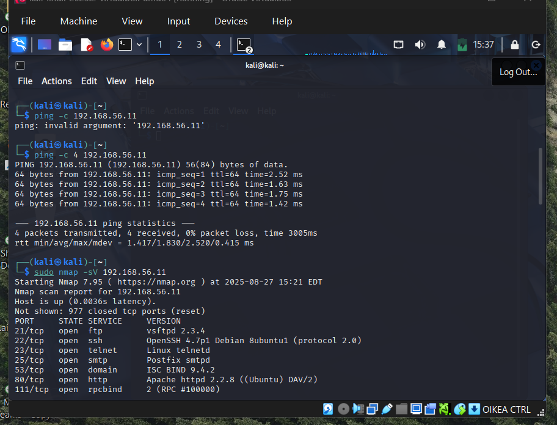
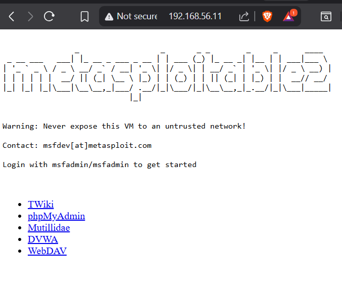
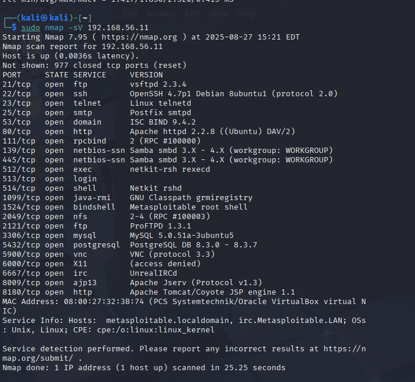

## x)
Herrasmieshakkerit: Yleinen hyvä, vieraana Jukka Niva 18 JUN - 1h 9min. 

Herrat oli huolissaan nykyisestä verkon tilasta ja disinformaatiosta. Algoritmien objektiivisuudesta tai sen totaalisesta puuttumisesta. Ihmisten omien uskomuksien vahvistamisesta feedien koukutuksen perustana ja tästä johtuvasta kuplautumisesta.

Hutchins et al 2011: Intelligence-Driven Computer Network Defense Informed by Analysis of Adversary Campaigns and Intrusion Kill Chains
In this article the writer was worried that the traditional defenses like the antivirus and intrusion detection systems are not efective enough against advanced threats. To counter these lockheed and martin have an idea about intelligence-driven defence: using kill chain model to map attackers actions, link intrusions into campaigns and feed intelligence back into defenses. This way they can fight the threat itself.

Kill chain has seven phases: Reconnaissance, Weaponization: creating the payload trojan etc.
Delivery(email,websites,usb), Exploitation(code gets triggered), Installation(creating backdoors), Command & Control(connection back to attackers infrastructure), Actions on Objectives(theft etc.)

KKO 2003:36
Asianomainen oli syyllistynyt tietomurron yritykseen. Hyökkäys oli pysähtynyt palomuuriin. Hovioikeus arvioi että A oli aiheuttanut osuuskunnalle 20 000 ja yhtiölle 55 000 markan määräisen vahingon. Tekijä oli 17-vuotias ja häntä oli pidetty atk-alan asiantuntijana.

## a)
Hyper-V Kali-Linux-2025.2

## b)
ping 8.8.8.8 palauttaa "network is unreachable"

## c)
nmap on porttiscanneri. Ilmeisesti kalin mukana tuleva softa. T4: scannerin nopeus, arvot 0-5 välillä kelpaa 0 = hidas, 5 = nopee. -A: tää yrittää löytää mm. mikä käyttis on kyseessä, mikä serveri softa, ja tie hostille. Localhost eli oma kone (127.0.0.1)

näyttäis että kaikki 1000 porttia oli kiinni.

## d)
Asensin ssh:n ja apachen eli nyt scanneri näyttää että on host up ja 998 suljettua porttia.

## e)
Ei menny ihan ykkösellä hyper-veehen. Hyper-v ei osannu lukee vmdk fileja.

## f)

Kali löytää metasploitablen pingaamalla.

## g)

Metasploitable selaimessa.
## h)

